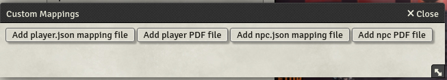

- 
- 
- 

# Sheet Export

This module is an evolution of the Arcanist's module PDF Export.

It aims to offer the ability to export in PDF all the sheets for PC, NPC, Spells, Items etc.

At the moment the module manages:


| Game System | Version  | Release | Sheets | Description                                                                                  |
| ------------- | ---------- | --------- | -------- | ---------------------------------------------------------------------------------------------- |
| dnd5e       | standard | 2.3.x   | PC     | The classical PC PDF from WotC for the PC for 2.3.x release                                  |
|             |          |         | NPC    | a custom PDF for NPC for 2.3.x release                                                       |
|             |          | latest  | PC     | The classical PC PDF from WotC for the PC for latest release                                 |
|             |          |         | NPC    | a custom PDF for NPC for latest release                                                      |
|             | custom   | latest  | -      | The folder dedicated to keep custom mapping from the user                                    |
|             | extended | 2.3.x   | PC     | A union of the classical WotC with extended pages for equipment and spells for 2.3.x release |
|             |          |         | NPC    | a custom PDF for NPC for 2.3.x release                                                       |
|             |          | latest  | PC     | A union of the classical WotC with extended pages for equipment and spells                   |
|             |          |         | NPC    | a custom PDF for NPC                                                                         |
|             | BR       | latest  | PC     | The Brazilian version of the classical PC PDF from WotC for the PC for latest release        |
| CoC7        | standard | latest  | PC     | The classical PC PDF for Call Of Cthulhu                                                     |
|             | custom   | latest  | -      | The folder dedicated to keep custom mapping from the user                                    |
| pfe2        | standard | latest  | PC     | The classical PC PDF for Pathfinder 2° Edition                                              |
|             | custom   | latest  | -      | The folder dedicated to keep custom mapping from the user                                    |

## Features

1. Allow to choose different mapping from the ones aviable for the game system
2. Allow to export images
3. Allow to override the default PDF with own both at export time or at config time
4. Allow to cusomize mapping in configuration
5. Error management that explain precisely which mapping field had problems
6. Generate mapping file from PDF form by uploading PDF
7. Allow to define own helper function
8. Allow to set/override custom fonts on PDF

## Documentation

### Export

As seen in the image below in the actor sheet there is an **Export to PDF** button in the toolbar


By pressing it you can choose to either use the default PDF that comes with the module (by pressing **Apply**) or to upload your own PDF (by choosing the button **Override mapping's PDF**).


Applying the data to the PDF could require some time so wait untill it is finished and presents the following content:


By pressing the round printer button the PDF is generated and downloaded to your computer.

### Mapping file
The json example rpresents the new mapping file.
Each PDF field is part of the fields element that can container a **pdf** field that HAVE to be tha same name of the field in the PDF, **content** is the javascript coded to execute to retrieve the proper content to place in the filed, the optional fields **font** and **font_size** allow to override font and its size.

**Helper functions**

The **helperFunctions** field allow to add custom functions needed in the content generation; to use tham, following the example the function MUST be invoked using the following syntax: **functionSet.**testFunction()

**Overriding fonts**
To override fonts you have to add an object in the **fonts** array with the following structure:
- id: the same ID used in the PDF file
- path: the path to the font file; local to the mapping file.

The ID will HAVE to be used in the field element with the **font** field.

**Images**
Images can be embedded in the generated PDF, the fields describe where position it considering that the PDF (0,0) origin start in the left bottom of each page and pages start with 0 index.

**Global content**
In the **globalContent** element we can add custom javascript code that will create content that will be accessible to each following fields execution.  This can be used to generate content that have to be splitted into several different fields.
There is the `functionSet.secm.getContentChunk('name_of_the_global_content')` to retrieve the content by automatically filling the PDF field with the chunk that will fit it.

``` json
{
  "releasemin": "",
  "pdfUrl": "/modules/sheet-export/mappings/game_system/standard/latest/pdf_file_name.pdf",
  "helperFunctions": {
    "testFunction": "function testFunction(items) {console.log(items);}"
  },
  "fonts": [
    {
      "id": "font_name",
      "path": "/modules/sheet-export/mappings/game_system/standard/latest/font_name.ttf"
    }
  ],
  "globalContent": [
    {
      "content": "(function(h) {\n      const d = document.createElement(\"div\");\n      d.innerHTML = h;\n      return d.textContent || d.innerText || \"\";\n    })(@system.details.biography.value)\n ",
      "id": "biography"
    }
  ],
  "images": [
    {
      "path": "@img",
      "page": 0,
      "pos_x": 0,
      "pos_y": 0,
      "width": 100,
      "height": 100
    }
  ],
  "fields": [
    {
      "content": " @items.filter(i => i.type === 'class').map(i => `${i.name} ${i.system.levels}`).join(' / ') ",
      "pdf": "player",
      "font": "font_name",
      "font_size": 19
    },
    {
      "content": " functionSet.testFunction(@items) ",
      "pdf": "ClassLevel"
    },
    {
      "content": " functionSet.secm.getContentChunk('biography')",
      "pdf": "text1",
      "font": "font_name",
      "font_size": 9
    },
    {
      "content": " functionSet.secm.getContentChunk('biography')",
      "pdf": "text2"
    }
  ]
}
```

#### Mapping override
It is possible to override mapping by writing javascrit code in the `system-functions.js` file in the specific mapping folder.
There are 2 functions that can be used to override mapping:
- **getAtReplacement**: this function defines the string to be used to replace teh **@** that is tipically used in the mapping
- **preMapping**: this function is called BEFORE the actual mapping is done (AND before the @ replacement takes place); the whole mapping fiedls array is passed and it is expected that it is returned, this way it will be possible for the mapping author to alter add or delete mapping fields.  It can be useful for those fields that are repetitive and could be generated dynamically and programmatically so that there is no need to edit the mapping file for all those fields (like in the spells or skills).  In the class there are already aviable the actor, the sheet and the sheetType, so it is also possible to return the content of those fields.  Just remember that the array is an array of JSON objects and thus the content need to be a string that will be subsequently parsed by the execute function. In the mapping it will be possible to reference content of the class like this: ` "content": " functionSet.system.myCustomFunctionCreatedInClass('biography')" ` or ` "content": " functionSet.system.myCustomAttributeInTheClass" `

### Settings

The settings form presents the drop down list for choosing the mapping for the game system of the world for your game; after saving a refresh will be asked.


The **Edit internal mapping** button opens a dialog to see the content of the mapping file; you will be able to change the scripting of the mapping but beware since this could break the mapping, the advice is to download the mapping file from the module and to customize it by using the custom mapping option.


The button **Generate mapping from PDF** allows you to generate the mapping file from the PDF file you will upload: you will get a json file with all PDF fields listed and all the mapping empty for you to complete.

The button **Set custom mapping** in the settings form allows you to upload yours json and PDF files.



## Changelog
[Changelog](CHANGELOG.md)

## Support
Please open issues on this repo for any problems that you can have using this module.

If you want to support this work 
<a href="https://www.buymeacoffee.com/lucagioppo" target="_blank"></a>