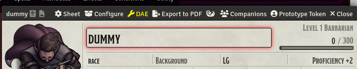
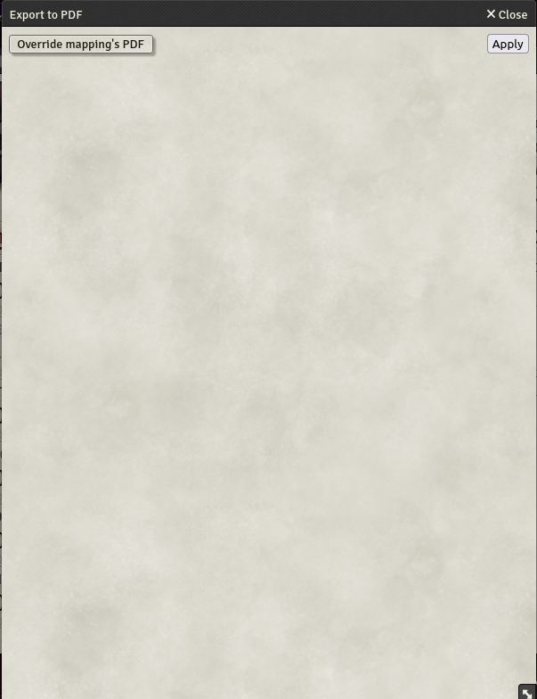
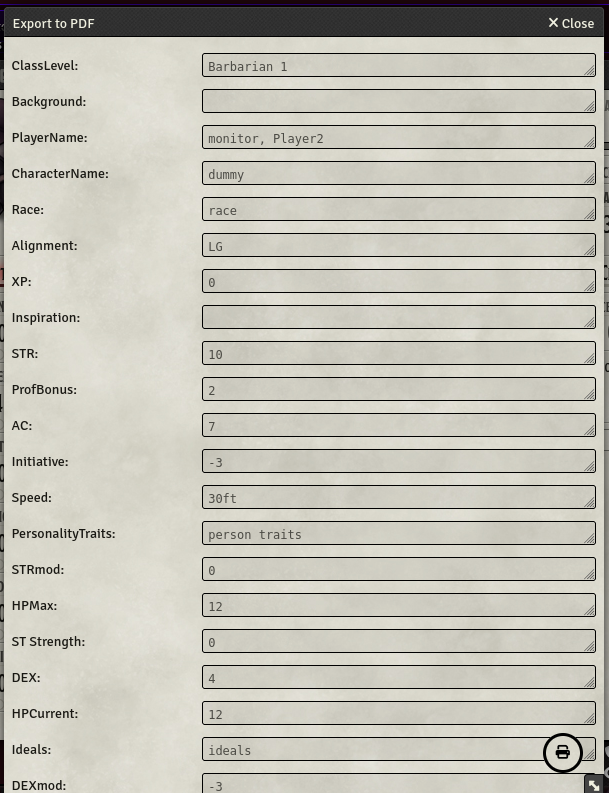
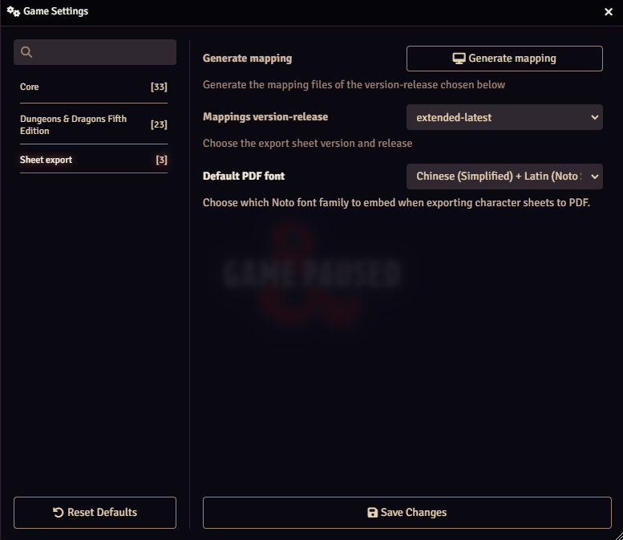
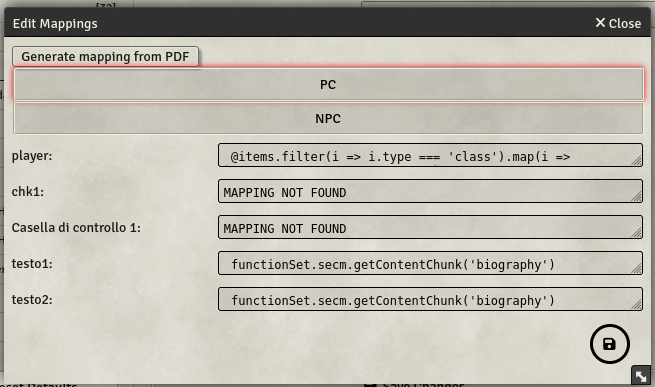

- 
- 
- 

# Sheet Export

This module is an evolution of the Arcanist's module PDF Export.

It aims to offer the ability to export in PDF all the sheets for PC, NPC, Spells, Items etc.

At the moment the module manages:


| Game System | Version    | Release | Sheets | Mantainer                             | Description                                                                           |
| ------------- | ------------ | --------- | -------- | --------------------------------------- | --------------------------------------------------------------------------------------- |
| dnd5e       | standard   | latest  | PC     |                                       | The classical PC PDF from WotC for the PC for latest release                          |
|             |            |         | NPC    |                                       | a custom PDF for NPC for latest release                                               |
|             | extended   | latest  | PC     |                                       | A union of the classical WotC with extended pages for equipment and spells            |
|             |            |         | NPC    |                                       | a custom PDF for NPC                                                                  |
|             | BR         | latest  | PC     |                                       | The Brazilian version of the classical PC PDF from WotC for the PC for latest release |
| pfe2        | remastered | latest  | PC     | [bushvin](https://github.com/bushvin) | The remastered PC PDF for Pathfinder 2° Edition                                      |

## Features

1. Allow to choose different mapping from the ones aviable for the game system (like in the case of dnd5e with standard and extended)
2. Allow to export images in the PDF
3. Error management that explain precisely which mapping field had problems
4. Generate mapping file from PDF form by uploading PDF
5. Allow to code the mapping in a dedicated class with the option of creating own functions to help the work
6. Override PDF (it has to have the same mapping attributes to work)

## Documentation

### Export

As seen in the image below in the actor sheet there is an **Export to PDF** button in the toolbar



By pressing it you can choose to either use the default PDF that comes with the module (by pressing **Apply**) or to upload your own PDF (by choosing the button **Override mapping's PDF**).



Applying the data to the PDF could require some time so wait untill it is finished and presents the following content:



By pressing the round printer button the PDF is generated and downloaded to your computer.

### Mapping file

The mapping file is a JS file that has to be named "player.js" or "npc.js" and contains a class named **MappingClass** that inherits from the base class **baseMapping**

```javascript
import baseMapping from "../../../../scripts/baseMapping.js";

class MappingClass extends baseMapping {


    authors = [
        {
            name: 'gioppoluca',
            url: 'https://github.com/gioppoluca',
            github: 'https://github.com/gioppoluca',
        },
    ];
    this.pdfFiles.push({
            pdfUrl: '/modules/sheet-export/mappings/THE_GAME_SYSTEM/YOUR_PDF_FILENAME.pdf',
            nameDownload: \`\${this.actor.name ?? "character"}.pdf\`,
            name: "YOUR_PDF_FILENAME.pdf",
        });
    createMappings() {
      // HERE THE MAPPING CODE
      ...

      // HERE THE CODE TO EMBED THE IMAGE
      this.setImage(this.actor.img, 2, 40, 500, 120, 200);
    }
```

**Add images**
Images can be embedded in the generated PDF; as shown in the code above there is a function to call: the parameters are (image path to embed, page of the pdf, x position, y position, width, height).

**Global content**
The base class offers a function to keep content that could be splitted in different fields.
**setGlobalValue** function has a key parameter and the mapping value to assign the **Global Value**.
With the **getGlobalValue** it is ossible to get a number of charcters of the global content by passing (key to the content, start char, end char) the syntax is the same as the substring function.

### Settings

The settings form presents the drop down list for choosing the mapping for the game system of the world for your game; after saving a refresh will be asked.



The **Genarate mapping** button opens a dialog to access the button **Generate mapping for PC from PDF** allows you to generate the JS mapping file from the PDF file you will upload: you will get a js file with all PDF fields listed and all the mapping empty for you to complete.




## Changelog

[Changelog](CHANGELOG.md)

## Support

Please open issues on this repo for any problems that you can have using this module.

If you want to support this work
<a href="https://www.buymeacoffee.com/lucagioppo" target="_blank"></a>
