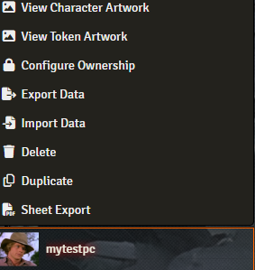

- 
- 
- 
- 

# Sheet Export

This module is an evolution of the Arcanist's module PDF Export.

It aims to offer the ability to export in PDF all the sheets for PC, NPC, Spells, Items etc.

At the moment the module manages:


| Game System     | Version    | Release | Sheets | Mantainer                             | Description                                                                           |
| ----------------- | ------------ | --------- | -------- | --------------------------------------- | --------------------------------------------------------------------------------------- |
| dnd5e           | standard   | latest  | PC     |                                       | The classical PC PDF from WotC for the PC for latest release                          |
|                 |            |         | NPC    |                                       | a custom PDF for NPC for latest release                                               |
|                 | extended   | latest  | PC     |                                       | A union of the classical WotC with extended pages for equipment and spells            |
|                 |            |         | NPC    |                                       | a custom PDF for NPC                                                                  |
|                 | BR         | latest  | PC     |                                       | The Brazilian version of the classical PC PDF from WotC for the PC for latest release |
| pf1             | standard   | latest  | PC     |                                       | The remastered PC PDF for Pathfinder 1° Edition                                      |
| pfe2            | standard | latest  | PC     | [bushvin](https://github.com/bushvin) Original work | The remastered PC PDF for Pathfinder 2° Edition                                      |
| CoC7            | standard   | latest  | PC     |                                       | The PC PDF for Call of Cthuluh 7° Edition                                            |
| sfrpg           | standard   | latest  | PC     |                                       | The PC PDF for Starfinder Edition                                                     |
| shadowrun6-eden | standard   | latest  | PC     |                                       | The PC PDF for Shadowrun 6° Edition (incomplete)                                     |
| swade           | standard   | latest  | PC     |                                       | The PC PDF for SWADE                                                                  |
| vtme5           | standard   | latest  | Vampire, Werewolf     |                                       | The Vampire and Werewolf PDF for World of Darkness - Vampire the Masquerade                                                                  |
| black-flag           | standard   | latest  | PC     |                                       | The PC PDF for Black Flag - Tales of the Valiant                                                                  |
| cosmere-rpg           | standard   | latest  | PC     |   [boxfriend](https://github.com/boxfriend)             | The PC PDF for Cosmere RPG                                                                  |
| dragonbame           | standard   | latest  | PC     |               | The PC PDF for Dragonbane (draft)                                                          |

If you want to become a mantainer of a game system, please contact me.

## Features

1. Allow to choose different mapping from the ones available for the game system (like in the case of dnd5e with standard and extended)
2. Allow to export images in the PDF
3. Error management that explain precisely which mapping field had problems
4. Generate mapping file from PDF form by uploading PDF
5. Allow to code the mapping in a dedicated class with the option of creating own functions to help the work
6. Override PDF (it has to have the same mapping attributes to work)

## Documentation

### Export

As seen in the image below in the actor sidebar menu on  the right click there is the  **Export to PDF** button



By pressing it you can choose to either use the default PDF that comes with the module (by pressing **Apply**) or to upload your own PDF (by choosing the button **Override mapping's PDF**).


Applying the data to the PDF could require some time so wait until it is finished and presents the following content:


By pressing the round printer button the PDF is generated and downloaded to your computer.

### Mapping file

The mapping file is a JS file that has to be named "player.js" or "npc.js" and contains a class named **MappingClass** that inherits from the base class **baseMapping**

```javascript
import baseMapping from "../../../../scripts/baseMapping.js";

class MappingClass extends baseMapping {


    authors = [
        {
            name: 'gioppoluca',
            url: 'https://github.com/gioppoluca',
            github: 'https://github.com/gioppoluca',
        },
    ];
    this.pdfFiles.push({
            pdfUrl: '/modules/sheet-export/mappings/THE_GAME_SYSTEM/YOUR_PDF_FILENAME.pdf',
            nameDownload: \`\${this.actor.name ?? "character"}.pdf\`,
            name: "YOUR_PDF_FILENAME.pdf",
        });
    createMappings() {
      // HERE THE MAPPING CODE
      ...

      // HERE THE CODE TO EMBED THE IMAGE
      this.setImage(this.actor.img, 2, 40, 500, 120, 200);
    }
```

**Add images**
Images can be embedded in the generated PDF; as shown in the code above there is a function to call: the parameters are (image path to embed, page of the pdf, x position of the bounding box, y position of the bounding box, width of the bounding box, height of the bounding box).
The image will be placed within the defined bounding box in the proper page of the PDF; image will be scaled proportionally.

**Global content**
The base class offers a function to keep content that could be splitted in different fields.
**setGlobalValue** function has a key parameter and the mapping value to assign the **Global Value**.
With the **getGlobalValue** it is possible to get a number of characters of the global content by passing (key to the content, start char, end char) the syntax is the same as the substring function.

### Settings

The settings form presents the drop down list for choosing the mapping for the game system of the world for your game; after saving a refresh will be asked.


The **Genarate mapping** button opens a dialog to access the button **Generate mapping for PC from PDF** allows you to generate the JS mapping file from the PDF file you will upload: you will get a js file with all PDF fields listed and all the mapping empty for you to complete.
The **js** file will have to be associated to the proper system mapping. The best option is to open an issue and send both the PDF and the js file to the Discord server so that it will be possible to add it to the module; otherwise associate the newly create JS to the `systemMapping.js` file in the `systemMappingSheet` function.


## Changelog

[Changelog](CHANGELOG.md)

## Support

Please open issues on this repo for any problems that you can have using this module.
For discussing on my modules please join my [discord server:](https://discord.gg/FgKtjFRn3e)

If you want to support this work
<a href="https://www.buymeacoffee.com/lucagioppo" target="_blank"></a>
